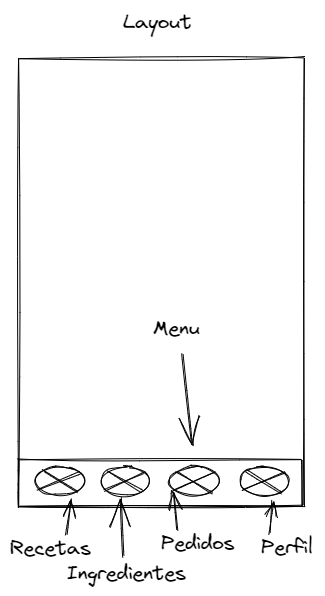
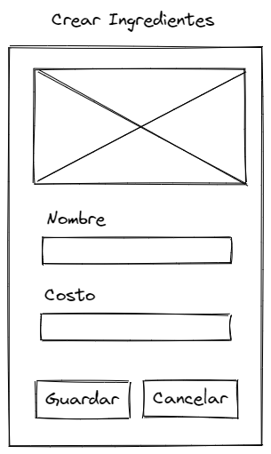
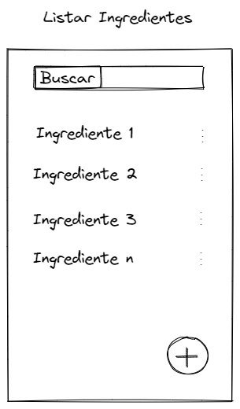

# CONTROL DE INGREDIENTES Y RECETAS
Link: [Link a este design doc](https://github.com/hroddev/hackathon-openbootcamp/tree/main/design-docs)

Author(s): Hector Rodriguez R.

Status: [Borrador]

Ultima actualización: 2022-09-22

## Contenido
- Goals
- Non-Goals
- Background
- Overview
- Detailed Design
  - Solucion 1
    - Frontend
    - Backend
  - Solucion 2
    - Frontend
    - Backend
- Consideraciones
- Métricas
___
## Links
- [Demo](#)
- [Repositorio](https://github.com/hroddev/hackathon-openbootcamp)
- [OpenBootCamp](https://campus.open-bootcamp.com/)
- [Plantilla del design docs](https://github.com/charliesbot/design-docs)
___
## Objetivos
Es mi primer hackaton y primera app, quiero poner en práctica lo aprendido dentro de los cursos de Open Boot Camp.  

Quiero hacer un app que permita a los usuarios poder registrar y llevar un control de sus recetas como primera fase. 

En próximas versiones me gustaría agregarle integrarlo a un sitio web con ecommerce para que los clientes puedan realizar sus pedidos.
___
## Goals
- Ingresar ingredientes de materia prima
- Crear sus recetas
- Crear pedidos
- Crear Clientes
- Que sea fácil de usar, pensado una pantalla móvil pero que pueda ser usado en PC o tableta.
- Confirmar por correo a los clientes sus pedidos y pagos.
___
## Non-Goals
- Facturar pedidos
- Integrar con una tienda
- Ingresar envases o material de empaque
- Crear proveedores
- Realizar compras de insumos o materias primas
- Autenticarse
___
## Background
La idea nace de una necesidad del negocio de mi esposa Karine (cliente :), ella actualmente lleva su control de inventario y pedidos en hojas de cálculos, todo muy organizado pero a medida que pasa el tiempo y crece la cantidad de clientes, pedidos y productos se hace más complicado llevarlo.

Por ejemplo para realizar una cotización o presupuesto para un pedido especial, debe abrir una hoja de calculo y copiar un pedido similar y hacer los cambios. A medida que aumenta el volumen de pedidos se hace mas tedioso de llevar, sumandole el riesgo de estimar mal el costo del pedido y que al final pierda en la venta.

También la gestión de cobro se complica al aumentar la cantidad de pedidos, actualmente los cobros son realizados por whatsapp y luego pasados a un cuaderno. Me gustaría automatizar esa parte para que pueda tener más claridad lo que le deben y las propuestas que fueron enviadas y no fueron ordenadas para darle un seguimiento, todo de una forma simple que pueda ser realizada desde el teléfono móvil.
___
## Overview
Primeramente el app debe poder usarse desde el teléfono móvil pero también debe permitir ser usado desde una PC o una tableta. Debido a que hay partes por ejemplo cuando realiza el costeo y la parte administrativa que puede hacerse más cómodo desde la PC, pero si necesita enviar una propuesta de un pedido lo pueda hacer directamente desde el móvil. 

Hago enfasis en esta parte porque me enfocaré en hacer una interfas limpia y muy intuitiva, ya que no encontré o no la encontrado por el momento, una app que haga simple el proceso de llevar el control de las recetas y los pedidos a la vez.

El usuario podrá crear y consultar:
    - Clientes
    - Ingredientes
    - Recetas
    - Pedidos
___
## Detailed Design

Como primera fase me enfocaré en terminar todas las funcionalidades básicas del proyecto, como las pantallas de mantenimiento y las de consulta y luego trabajaré en la parte del diseño.

Usaré componentes para reducir la cantidad de código y se me facilite en el futuro la adición de nuevas funcionalidades.

### ***Diseño de las pantallas***

___
### Frontend
Para la parte del front usaré *NextJS* y *Tailwind CSS*
### Backend
En la parte del back usaré una base de datos en *MySql* junto con *Prisma* y *docker-compose*
## Consideraciones
Por la limitante del tiempo he tratado de reducir el alcance del tiempo, todo depende de como vaya mi avance puedo ir agregando o puliendo el diseño de la aplicación.